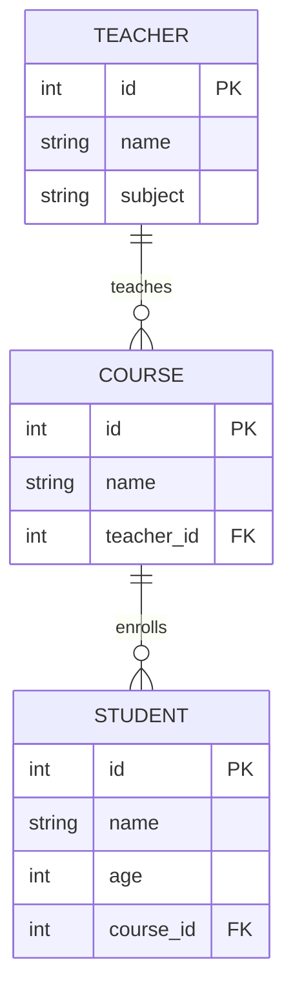

# Database Diagram

The school has **teachers**, **courses**, and **students**.

- A **teacher** teaches zero or more **courses**.
- A **course** is taught by exactly one **teacher** and has zero or more **students**.
- A **student** belongs to exactly one **course**.

These are called **one-to-many** relationships.

## Tables

```
┌──────────────────┐          ┌──────────────────┐          ┌──────────────────┐
│    teachers      │          │     courses      │          │    students      │
├──────────────────┤          ├──────────────────┤          ├──────────────────┤
│ id         PK    │◄────┐    │ id         PK    │◄────┐    │ id         PK    │
│ name             │     │    │ name             │     │    │ name             │
│ subject          │     └────│ teacher_id FK    │     └────│ course_id  FK    │
└──────────────────┘          └──────────────────┘          │ age              │
                                                            └──────────────────┘
```

- `PK` = **Primary Key**. Unique ID for each row — the DB uses it to find a row fast.
- `FK` = **Foreign Key**. A pointer from one table to another. It's the DB's way
  of saying "this column must match an `id` over in that other table".

## Mermaid (renders on GitHub)



## Why separate tables instead of one big one?

Imagine a single `students` table with `teacher_name`, `course_name`, `subject`
all in it. If Ms. Ada changes her last name, you'd have to update every student
row that has her on it. By splitting into three tables and linking them with IDs,
you update Ms. Ada in one place and everyone still points to the correct record.
This is called **normalization**.
